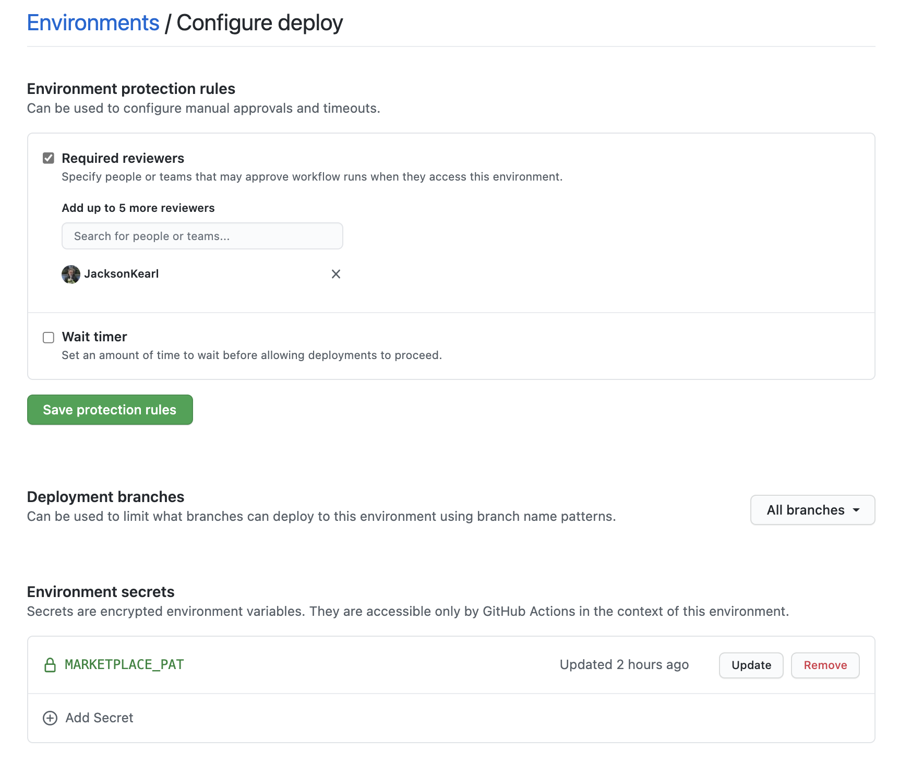
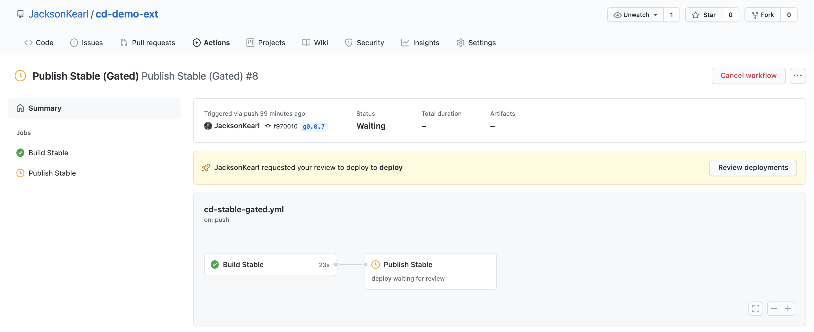

# Continuous Deployment Demo Extension

This repo exists to demonstrate how to use GitHub Actions to run continuously deploy your VS Code extension. It can both:

- Publish a stable release to the marketplace and GitHub's release page when a new tag is pushed
- Publish a nightly release to the marketplace and an artifact to the runner Action on a set schedule (nightly by default). A vNightly branch is created to track the latest nightly build.

Start by generating a Marketplace PAT by following the instructions [here](https://code.visualstudio.com/api/working-with-extensions/publishing-extension#get-a-personal-access-token). Then add it as a repository secret with name `MARKETPLACE_PAT` ([instructions](https://docs.github.com/en/free-pro-team@latest/actions/reference/encrypted-secrets#creating-encrypted-secrets-for-a-repository)).

Next, copy `.github/workflows/cd-stable.yml` to your extension push it to GitHub, then create releases via:

```bash
VERSION=$(node -e "console.log(require('./package.json').version)")
git tag v$VERSION
git push origin v$VERSION
```

> Note: The Action as written assumes your extension can be built via `npm i && vsce package`, if this is not the case some modifications to the Action will be required.

## Nightly Build

To enable a nightly build copy `.github/workflows/cd-nightly.yml` to your extension push it to GitHub, then releases will be created automatically every day that chanages are made, or manually via:

```bash
curl --location --request POST 'https://api.github.com/repos/[Your Extension]/dispatches' \
  --header 'Authorization: Bearer [GitHub PAT with push rights to the repo]' \
  --header 'Content-Type: text/plain' \
  --data-raw '{ "event_type": "trigger-nightly-publish" }  '
```

> Note: The Action as written assumes your nightly build is simply your stable build with some packaage.json entries modified, if this is not the case some modifications to the Action will be required.

## Gated Releases

In cases where you'd prefer to manually verify the built extension prior to releasing to the market place, the `cd-stable-gated.yml` workflow may prove helpful. This uses [GitHub Environments](https://docs.github.com/en/actions/reference/environments) to require a reviewer or some time to pass before proceeding to upload the extension to the marketplace. To begin, create an environment called "deploy" with your desired protections. If you wish, you can place the `MARKETPLACE_PAT` in this environment's secrets, which will prevent it from being read by other actions in the repo.



By default, the gated environment pipeline is set to run on tags prefixed with `g`. Upon pushing a tag with the `g` prefix, an Action will be created that will first build the release and create a GitHub Release for it, which will have the extension attached as a `.vsix`. The reviewer should test the extension, then assuming it is sound, navigate to the Action in the actions tab, and click "Review Deployments", then approve the release to kick off the publish to the marketplace.
.

Note that the Release created will be an official GitHub Release, even before testing has completed. This is the smoothest flow as it doesn;t require any manaul releasing, but it could cause issues if you decide not to release the build. In that case, you should delete the Release before attempting to run the job again. An alternative is to create the release as a draft, by uncommenting the line in the action file, which would the require the reviewer to mark the release as stable after completing their review.

> Note, it'd be nice for the extension to be kept in an asset so no release is made until testing, but that is not possible due to https://github.com/actions/upload-artifact/issues/53
